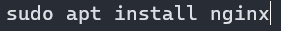
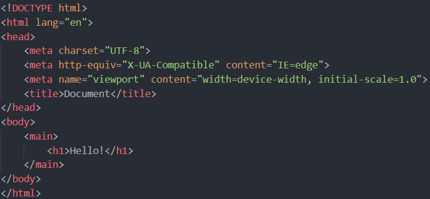
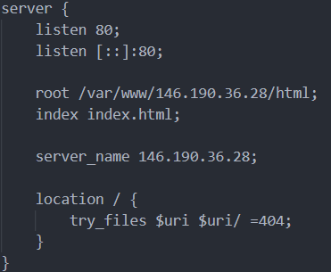
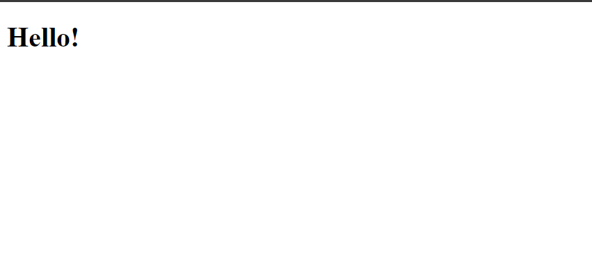
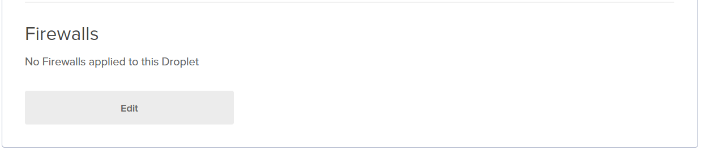
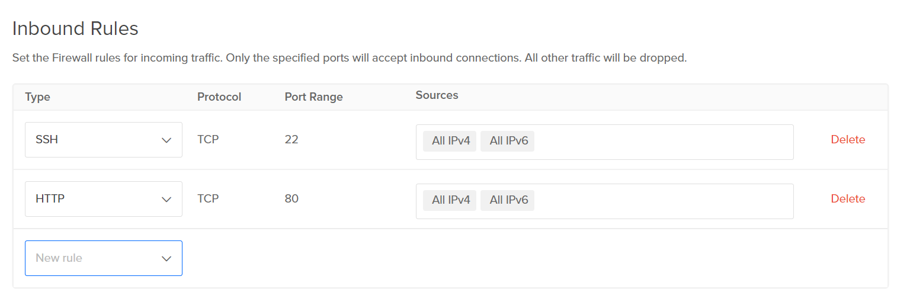
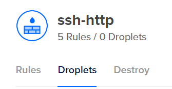

# 2420_week12_Lab

Liam
Andrew

## Installing nginx

## Creating a homepage
1. Create a file called index.html
2. Add a basic html layout

3. Place the page in `/var/www/<your_ip>/html/`.

## Create a serverblock
1. Create a file in `/etc/nginx/sites-available/`
2. Add a serverblock layout.

3. Create a link to your site using `sudo ln -s /etc/nginx/sites-available/<your_ip> /etc/nginx/sites-enabled`
4. Test your site
5. Restart nginx using `sudo systemctl restart nginx.service`

## Test your server
1. Navigate to your server ip in a web browser.
2. If you see your homepage you've succeeded in creating a nginx server!

## Setting up a Digital Ocean firewall
1. Navigate to your Ditial Ocean droplet dashboard.
2. Select your droplet and navigate to the networking tab.
3. Scroll down to the Firewall section and click edit.

4. Add a name to your firewall.
5. In the inbound rules section select the dropdown and select SSH and HTTP.

6. Scroll down and click Create Firewall.
7. Click on the name of your firewall in the firewall list.
8. Click Droplets

9. Click Add Droplet then search for your droplet name.
10. Click done and your droplet should be added to the firewall.